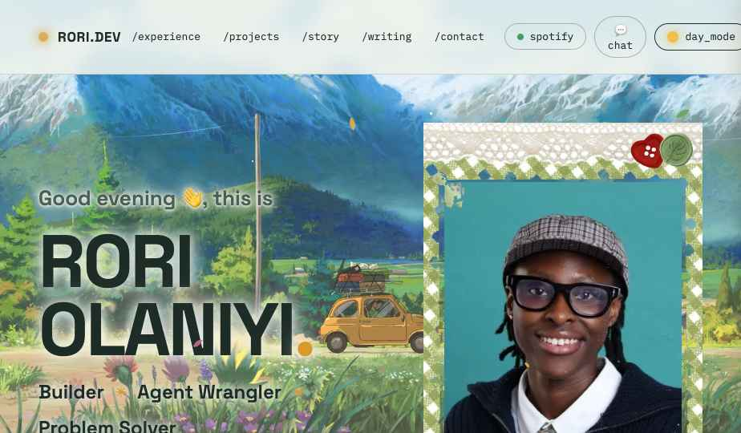

# rori.dev 🍃

My personal portfolio, themed around Studio Ghibli: a valley painting by day, Howl's castle by night.

**Live site → [rori-portfolio.vercel.app](https://rori-portfolio.vercel.app)**



## What's in it

- Day and night modes (every visit opens at night)
- Scroll-driven motion, soot sprites, and a Spotify player that keeps playing across pages
- A chatbot that answers questions about me, iMessage style
- Experience, projects, writing, fits, and a contact form

## Built with

React 19 · TypeScript · Vite · deployed on Vercel

## Run it locally

```bash
cd web
npm install
npm run dev      # http://localhost:5173
```

Content (jobs, projects, links, chatbot facts) lives in `web/src/data.ts`, and each section is a component in `web/src/components/`.

If you like it, a ⭐ means a lot!
